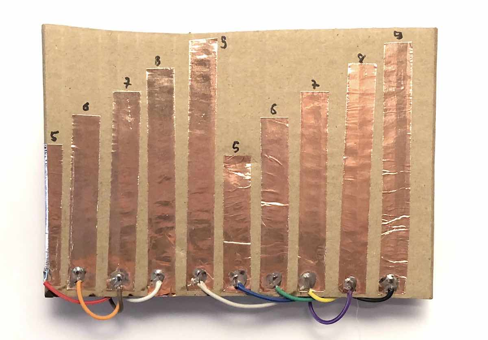
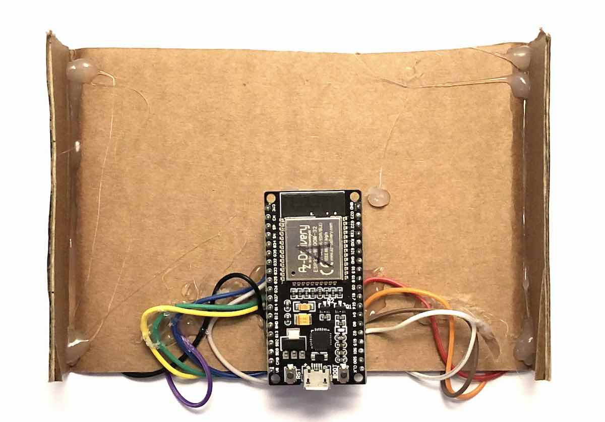
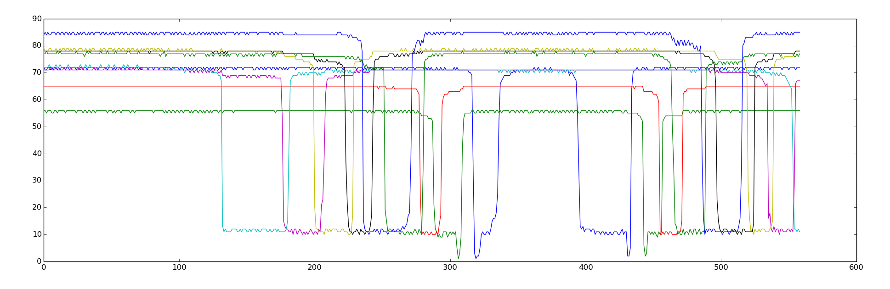

# espnow-capacitive-sensing

  

This repository contains code for experimenting with built-in capacitive touch functionality in ESP32. The implementation sends touch values via the ESPNOW protocol either to another ESP32 or a host computer at 100Hz.

  - firmware: Code that can be compiled with Arduino IDE and flashed to microcontroller.
  - receiver: Receiving code to be compiled on a Linux computer with a monitor-mode enabled Wifi card. 
  - data: Example data collected using the hardware pictured above.

# Visualized example data

  

